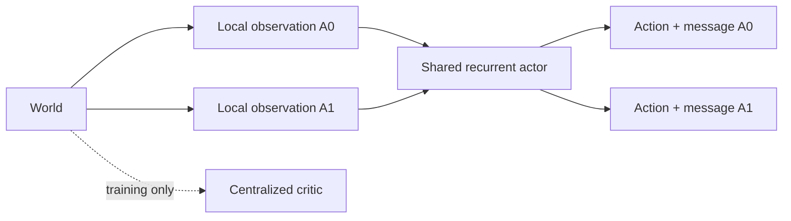

# Embodied Stag Hunt and Emergent Communication

## Multi-agent reinforcement learning experiment

- Two embodied agents must choose between safe individual reward and risky cooperation.
- Each agent holds complementary private information about the cooperative target.
- Agents exchange ungrounded discrete symbols while navigating the world.
- Goal: determine when communication is causally used and when it develops linguistic structure.

---

## Environment

- `7 × 7` open grid.
- Two agents: A0 and A1.
- Four stag targets: `colour × region`.
- Two safe hare targets.
- Maximum episode length: 30 timesteps.
- Successful stag capture requires simultaneous commitment by both agents.

![[attachments/Stag Hunt/environment.png]]

---

## Information structure

- Public to both agents:
  - All stag positions and attributes.
  - Both hare positions.
  - Current timestep.
  - Partner's previous symbol.
  - Partner position in the default condition.
- Private to A0:
  - Correct stag colour.
- Private to A1:
  - Correct stag region.
- Combining both clues identifies exactly one stag.

```text
A0 knows: BLUE
A1 knows: EAST

BLUE + EAST → S3
```

---

## Agent observation

- Each structured observation becomes a normalized 34-dimensional vector.
- Components:
  - Agent identity: 2 dimensions.
  - Own position: 2.
  - Partner position: 2.
  - Stag positions: 8.
  - Stag colour and region attributes: 8.
  - Hare positions: 4.
  - Private clue: 2.
  - Received symbol: 5.
  - Normalized timestep: 1.
- Unknown private attributes are represented by zero.

---

## Shared recurrent actor

- A0 and A1 share the same PyTorch actor parameters.
- Each agent has:
  - A different local observation.
  - A one-hot agent identity.
  - A separate recurrent hidden state.
- Parameter sharing provides common learning machinery.
- Separate GRU memories allow role-dependent behaviour.

```text
Observation, size 34
        ↓
Linear(34 → 128)
        ↓
LayerNorm → Tanh
        ↓
GRUCell(128 → 128)
```

---

## Policy outputs

- The GRU state feeds two categorical policy heads.
- Physical-action head:
  - `Linear(128 → 6)`.
  - Stay, up, right, down, left, interact.
- Message head:
  - `Linear(128 → 5)`.
  - Silence plus four ungrounded symbols.
- Both actions are sampled at every timestep.
- At deterministic evaluation, each head selects its highest-logit action.

$$
\log \pi(a_t,m_t)
=
\log \pi_{\mathrm{move}}(a_t)
+
\log \pi_{\mathrm{message}}(m_t)
$$

---

## Communication timing

- Movement and message are chosen simultaneously.
- A message emitted at time $t$ is received at time $t+1$.
- An agent cannot react to a symbol emitted during the same step.
- The GRU can remember previous symbols and actions.
- Symbols have no predefined semantics.

```text
A0 sends α at t  ──►  A1 receives α at t+1
A1 sends β at t  ──►  A0 receives β at t+1
```

---

## One environment step

1. Each agent receives its local observation.
2. The observation is normalized and encoded.
3. The GRU updates each agent's private memory.
4. Each policy samples:
   - One physical action.
   - One message.
5. The environment applies both physical actions simultaneously.
6. Interactions and rewards are resolved.
7. Messages are delivered in the next observations.
8. The timestep advances.

---

## Cooperative episode

- A0 communicates information about colour.
- A1 communicates information about region.
- Both agents combine private and received information.
- Both identify the same cooperative target.
- Both navigate to the target.
- Both select `interact` on the same timestep.
- Successful outcome:
  - A0 reward: 4.
  - A1 reward: 4.

![[attachments/Stag Hunt/agent_trajectories.png]]

---

## Other episode outcomes

- Hare commitment:
  - Safe individual reward.
  - Current implementation terminates the entire episode.
  - Example return: $(2,0)$.
- Failed stag commitment:
  - One agent commits without its partner.
  - Default return: $(0,0)$.
- Timeout:
  - No target commitment within 30 steps.
- Failed-stag reward and termination rules are configurable experimental choices.

---

## Learning without a critic

- Agents can learn directly from observed returns using REINFORCE.
- The physical environment is not differentiable.
- Learning uses the log probability of sampled actions:

$$
\nabla J
\approx
G_t \nabla \log \pi(a_t,m_t \mid o_t)
$$

- A successful terminal return reinforces earlier sampled actions and messages.
- A partner's behaviour is treated as part of the environment.
- Main limitation: raw returns have high variance.

---

## Why use a baseline?

- The same action may succeed or fail depending on the partner.
- Most intermediate rewards are zero.
- A zero-return failure gives little signal under raw REINFORCE.
- A baseline compares the observed return with what was expected.

$$
A_t = G_t - b_t
$$

- $A_t > 0$: sampled behaviour was better than expected.
- $A_t < 0$: sampled behaviour was worse than expected.
- A running mean return is the simplest baseline.

---

## Centralized critic

- Training-only value estimator.
- Observes the complete environment state.
- Predicts expected future return; it does not choose actions.
- Current input:
  - Both agent positions.
  - All targets and attributes.
  - Correct colour and region.
  - Previous messages.
  - Timestep.

```text
Global state, size 29
        ↓
Linear(29 → 128) → Tanh
        ↓
Linear(128 → 128) → Tanh
        ↓
Linear(128 → 1)
```

---

## Actor–critic update

- Critic prediction:

$$
V(s_t) \approx \mathbb{E}[G_t \mid s_t]
$$

- Advantage:

$$
A_t = G_t - V(s_t)
$$

- Actor update:

$$
\mathcal{L}_{actor}
=
-\log \pi(a_t,m_t \mid o_t) A_t
$$

- Critic update:

$$
\mathcal{L}_{critic}
=
\left(V(s_t)-G_t\right)^2
$$

---

## Centralized training, decentralized execution

- During training:
  - Actors receive local observations.
  - Critic receives the global state.
  - Critic improves credit assignment and reduces variance.
- During evaluation:
  - Critic is removed.
  - Each actor uses only local observation, delayed messages, and GRU memory.
- Global critic information never directly selects an action.



---

## Individual rewards and critic design

- Stag Hunt rewards can differ between agents.
- Example:

```text
A0 captures hare: reward 2
A1 receives: reward 0
```

- A single scalar critic naturally represents a shared team return.
- To preserve individual incentives, preferred critic:

$$
V_i(s_t,i)
$$

- Shared centralized critic conditioned on agent identity.
- Produces a separate advantage for A0 and A1.
- Alternative: critic outputs `[V_A0, V_A1]`.

---

## Proposed training progression

1. Scripted and oracle-policy sanity checks.
2. REINFORCE using each agent's observed episode return.
3. REINFORCE with a running-mean baseline.
4. Independent local actor–critic baseline.
5. Centralized-critic MAPPO.
6. Communication interventions and cross-play.

- Starting simple reveals whether learning pressure comes from the environment.
- The centralized critic should improve efficiency, not define the phenomenon.

---

## Current implementation status

- Implemented:
  - PettingZoo parallel environment.
  - Complementary private clues.
  - Delayed discrete communication.
  - Recurrent PyTorch actor.
  - Physical-action and message heads.
  - Centralized critic scaffold.
  - CPU, MPS, and CUDA device selection.
  - Scripted trajectories and environment plots.
- Not implemented:
  - PPO/MAPPO optimization.
  - Rollout buffer and GAE.
  - Parallel environment collection.
  - Learned cooperative policy.
  - Communication interventions.

---

## Communication versus dialogue

- Current environment supports repeated two-way communication.
- Both private clues are static and available at reset.
- An optimal policy may exchange both clues once and then navigate.
- This is reciprocal signalling, not necessarily dialogue.
- Functional dialogue requires:
  - Proposal-dependent information.
  - Replies conditioned on earlier messages.
  - Confirmation or rejection.
  - Plan revision.
  - Multi-turn communication that is causally necessary.

---

## Experimental questions

- Is communication causally necessary for cooperation?
- Does communication change equilibrium selection as risk increases?
- Do agents use symbols or visible movement to coordinate?
- Does learned communication generalize to unseen layouts and partners?
- Does restricted bandwidth encourage reusable structure?
- When does reciprocal signalling become functional dialogue?

