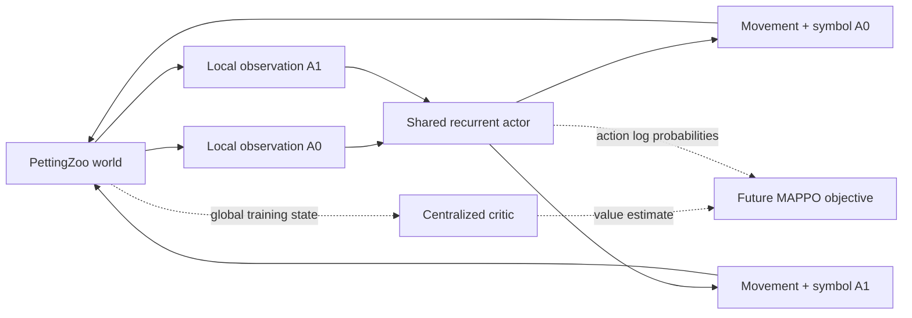

# Stag Hunt Language Emergence — Episode and Agent Architecture

Related:

- [[Language Emergence with Stag Hunt Game]]
- [[Stag Hunt Language Emergence - Experiment Design]]
- [[Stag Hunt Language Emergence - Repository Setup]]
- [[Stag Hunt Language Emergence - Agent and Training Slides]]

## Summary

The current environment supports repeated two-way communication between two
recurrent agents, but it does not yet require functional dialogue.

Both agents receive complementary, static private information at the beginning
of an episode. An efficient protocol could exchange those two facts
simultaneously in the first timestep and then use the rest of the episode for
navigation.

The safest description of the current experiment is:

> Two recurrent agents exchange ungrounded discrete symbols while navigating an
> embodied Stag Hunt. Their complementary private clues make reciprocal
> communication useful, but the current task does not yet require sequential
> dialogue.

## Current world

Each episode contains:

- A `7 × 7` grid.
- Two agents: A0 and A1.
- Four stag targets.
- Two individually capturable hares.
- A maximum duration of 30 steps.

The stags represent every combination of two colours and two regions:

| Target | Colour | Region |
|---|---|---|
| S0 | red | west |
| S1 | red | east |
| S2 | blue | west |
| S3 | blue | east |

One stag is sampled as correct at the beginning of the episode.

For example:

```text
Correct colour = blue
Correct region = east
Correct target = S3
```

![[attachments/Stag Hunt/environment.png]]

## Distribution of information

Both agents publicly observe:

- All stag positions.
- The colour and region of every stag.
- Both hare positions.
- Their own position.
- The other agent's position in the default condition.
- The current timestep.
- The symbol received from the other agent on the previous timestep.

The relevant private information is divided between them:

```text
A0 privately knows: colour = blue
A1 privately knows: region = east
```

Neither agent can identify S3 alone:

```text
A0: blue could refer to S2 or S3
A1: east could refer to S1 or S3
```

Combining the two clues identifies exactly one stag:

```text
blue + east → S3
```

## Agent input

The structured PettingZoo observation is converted into a normalized
34-dimensional vector:

| Component | Dimensions | Meaning |
|---|---:|---|
| Agent identity | 2 | One-hot identity for A0 or A1 |
| Own position | 2 | Normalized $(x,y)$ position |
| Partner position | 2 | Normalized position, or $(-1,-1)$ when hidden |
| Stag positions | 8 | Four public $(x,y)$ positions |
| Stag attributes | 8 | Colour and region for all four stags |
| Hare positions | 4 | Two public $(x,y)$ positions |
| Private clue | 2 | A0's colour or A1's region; zero means unknown |
| Received symbol | 5 | One-hot silence plus four symbols |
| Timestep | 1 | Current step divided by the horizon |
| **Total** | **34** | |

The private clue is represented with zero for the unknown component:

```text
A0 clue: [2, 0]  # blue, unknown region
A1 clue: [0, 2]  # unknown colour, east
```

The received-symbol vector contains:

```text
[silence, symbol 1, symbol 2, symbol 3, symbol 4]
```

The four symbols have no predefined meanings.

## Actor architecture

A0 and A1 currently share the same actor parameters:

```text
34-dimensional observation
            │
            ▼
Linear(34 → 128)
            │
        LayerNorm
            │
           Tanh
            │
            ▼
GRUCell(128 → 128)
            │
            ├──► Linear(128 → 6)
            │         │
            │         ▼
            │    physical-action distribution
            │
            └──► Linear(128 → 5)
                      │
                      ▼
                 message distribution
```

The six physical actions are:

```text
stay
up
right
down
left
interact
```

The five message actions are:

```text
silence
symbol 1
symbol 2
symbol 3
symbol 4
```

The agents share network weights but receive:

- Different observations.
- Different one-hot identities.
- Separate recurrent hidden states.

The shared weights give both agents the same learning machinery. Their private
observations, identities, and independent memories allow them to develop
different roles.

### Recurrent state

Each agent maintains its own 128-dimensional GRU state throughout the episode.
This allows it to remember:

- Earlier private and public observations.
- Symbols received on previous steps.
- Its own movement history.
- Potential proposals, confirmations, or commitments.

The architecture therefore permits temporally dependent communication. The
current task, however, does not force the agents to use this capacity as
dialogue.

### Policy output

At each step, the actor produces two categorical distributions:

```text
π_move(move | observation, memory)
π_message(message | observation, memory)
```

During stochastic training or exploration, one action is sampled from each
distribution.

The joint policy log probability is:

$$
\log \pi(a_t,m_t)
=
\log \pi_{\text{move}}(a_t)
+
\log \pi_{\text{message}}(m_t)
$$

The two entropies are also added. This treats movement and communication as one
joint policy action for the future PPO objective.

During deterministic evaluation, each head selects its highest-logit action.

## Centralized critic

The intended training setup follows centralized training with decentralized
execution.

The critic receives a 29-dimensional global state containing:

- Both agent positions.
- All stag positions.
- All stag attributes.
- Both hare positions.
- The correct colour and region.
- The last emitted messages.
- The current timestep.

Its architecture is:

```text
29-dimensional global state
            │
            ▼
Linear(29 → 128) → Tanh
            │
            ▼
Linear(128 → 128) → Tanh
            │
            ▼
Linear(128 → 1)
            │
            ▼
V(global state)
```

The critic may use privileged global information to reduce the variance of
learning. It does not select actions and is not used during decentralized
episode execution.



## Beginning of an episode

At reset, the environment:

1. Samples the correct colour.
2. Samples the correct region.
3. Determines the correct stag.
4. Places the four stags in their appropriate physical regions.
5. Places the two hares.
6. Places A0 and A1.
7. Clears the previous messages to silence.
8. Initializes the episode timestep to zero.
9. Returns a different local observation to each agent.

Suppose the sampled factors are:

```text
colour = blue
region = east
```

At $t=0$:

```text
A0 knows blue.
A1 knows east.

A0 has received silence.
A1 has received silence.
```

The actor hidden states initially contain zeros.

## One environment step

At timestep $t$, both agents act simultaneously.

### 1. Encode observations

Each structured local observation is converted to a normalized tensor:

```text
o_t^A0 → x_t^A0
o_t^A1 → x_t^A1
```

### 2. Update recurrent memory

For each agent:

```text
encoded observation + previous GRU state
                    ↓
              new GRU state
```

The two agents use the same GRU parameters but update separate hidden states.

### 3. Produce movement and message distributions

For example:

```text
A0:
    physical action = move right
    message = symbol α

A1:
    physical action = move left
    message = symbol β
```

The learned meanings of $\alpha$ and $\beta$ are initially unknown.

### 4. Apply physical actions

The environment moves both non-interacting agents simultaneously.

An `interact` action does not move an agent. Instead, the environment checks
whether the agent is standing on a hare or stag.

### 5. Resolve commitment and rewards

The environment checks:

- Are both agents on the correct stag?
- Did both agents choose `interact`?
- Did either agent interact with a hare?
- Did an agent interact with a stag without its partner?

It then calculates rewards and determines whether the episode has ended.

### 6. Deliver messages

Messages emitted at time $t$ become part of the partner's observation at time
$t+1$:

```text
A0 sends α at t  ──►  A1 receives α at t+1
A1 sends β at t  ──►  A0 receives β at t+1
```

The one-step delay prevents an agent from reacting to a message emitted
simultaneously with its current action.

### 7. Advance the environment

The environment:

1. Increments the timestep.
2. Builds the next local observations.
3. Returns observations, rewards, terminations, truncations, and diagnostic
   information.

The process repeats until commitment or timeout.

## Example cooperative episode

The following is an illustrative interpretation. A learned protocol would not
begin with these predefined meanings.

### Timestep 0: exchange

```text
A0 privately knows blue.
A1 privately knows east.

A0 emits α.
A1 emits β.
```

After successful learning and causal analysis, one might interpret:

```text
α ≈ "blue"
β ≈ "east"
```

These interpretations are not provided to the agents.

### Timestep 1: receive

```text
A0 receives β.
A1 receives α.
```

Each recurrent policy now has:

- Its own clue.
- The other agent's symbol.
- The public list of targets.
- The current agent positions.
- Its recurrent history.

Both agents can identify S3.

### Navigation

The agents move toward S3 over several timesteps.

They may continue to:

- Repeat the original symbols.
- Emit silence.
- Signal their current target.
- Signal readiness to commit.
- Ignore the symbols and use visible movement.

The current environment does not force any particular communication strategy.

![[attachments/Stag Hunt/agent_trajectories.png]]

### Joint commitment

When both agents occupy S3, both must select:

```text
physical action = interact
```

on the same timestep.

The episode terminates with:

```text
reward(A0) = 4
reward(A1) = 4
outcome = joint_stag
```

## Other possible outcomes

### Hare

If A0 reaches and interacts with a hare first:

```text
reward(A0) = 2
reward(A1) = 0
outcome = hare
```

The current implementation terminates the whole episode on the first hare
commitment. This is not identical to a simultaneous matrix Stag Hunt in which
both agents independently choosing hare gives $(2,2)$. It is an experimental
design choice that should be evaluated before training.

### Failed stag

If an agent interacts with a stag without successful simultaneous commitment:

```text
reward(A0) = 0
reward(A1) = 0
outcome = failed_stag
```

The failed-stag payoff is configurable and could later become negative.

### Timeout

If nobody commits within 30 timesteps:

```text
outcome = timeout
```

## Is the current communication dialogue?

Not necessarily.

The current private information is:

- Static.
- Available at reset.
- Compact enough to transmit in one symbol.
- Symmetrically exchanged.

An efficient protocol could be:

```text
t = 0:
    A0 transmits "blue"
    A1 transmits "east"

t ≥ 1:
    both navigate toward blue-east
```

This is reciprocal signalling or two-way communication. It does not necessarily
contain:

- A proposal.
- A response to that proposal.
- New information acquired after the proposal.
- Rejection.
- Correction.
- Belief revision.
- A revised plan.

Repeating symbols while walking also does not by itself constitute dialogue.

The recurrent architecture and repeated channel make dialogue possible, but the
current information structure does not make it necessary.

## Proposed functional-dialogue episode

A stronger dialogue environment could have:

1. A0 proposes a target.
2. A1 privately inspects the proposed route or resource.
3. A1 confirms or rejects the proposal.
4. A0 maintains or revises the plan.
5. Both agents commit.

The critical addition is proposal-dependent information acquisition. A1 should
not already have all the relevant information at reset.

For example:

```text
A0 knows that blue stags are valuable.
A1 does not initially know which route is safe.

A0 proposes the blue-east stag.
A1 inspects the east route.
A1 discovers that the route is blocked.
A1 sends a rejection.
A0 changes its proposal.
A1 confirms the alternative.
Both agents commit.
```

Without conditional information acquisition, the agents can simply exchange all
their clues immediately.

## Explicit versus emergent dialogue

### Explicit staged dialogue

The environment could impose phases:

```text
PROPOSE → INSPECT → RESPOND → REVISE → COMMIT
```

Advantages:

- Easier to train.
- Easier to analyze.
- Guarantees multi-turn interaction.

Limitation:

- The experiment imposes conversational roles and turn structure in advance.

### Emergent dialogue

A stronger language-emergence experiment would provide:

- Ungrounded symbols.
- A physical `inspect` action.
- Information revealed only after inspection.
- Costly or irreversible commitment.
- Multiple viable proposals.
- No predefined confirm or reject symbols.

The researcher would determine after training whether symbols function as:

- Proposals.
- Confirmations.
- Rejections.
- Corrections.
- Commitments.

## Evidence required for a dialogue claim

To claim functional dialogue, evaluate whether:

1. A1's response changes when A0's proposal changes.
2. A0's later target changes when A1's reply is counterfactually replaced.
3. A0 revises its proposal following rejection.
4. Removing a turn reduces task success.
5. Reordering messages reduces task success.
6. Multi-round communication outperforms a one-round channel with matched
   bandwidth.
7. Replies remain dependent on previous messages after controlling for the
   replying agent's private observation.

A useful conditional-dependence measurement is:

$$
I(M_{B,t+1}; M_{A,t} \mid O_{B,t+1})
$$

However, conditional mutual information alone is not enough. Message
interventions must also change downstream behaviour or expected return.

## Current implementation status

Implemented:

- PettingZoo parallel environment.
- Complementary private observations.
- Delayed discrete channel.
- Recurrent PyTorch actor.
- Separate physical and message action heads.
- Centralized critic scaffold.
- Scripted environment demonstrations.
- CPU/MPS/CUDA device selection.

Not yet implemented:

- PPO/MAPPO optimization.
- Rollout buffer and generalized advantage estimation.
- Parallel environment collection.
- Learned cooperative policy.
- Communication interventions.
- Functional-dialogue information acquisition.
- Population turnover or evolutionary transmission.
