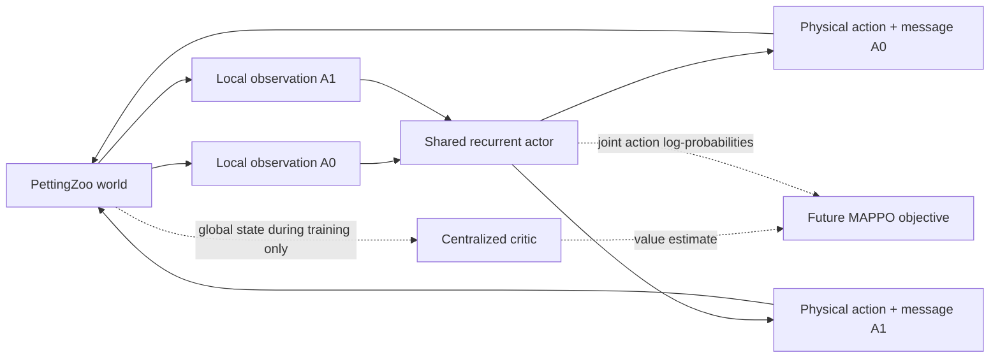

# Stag Hunt Language Emergence — Repository and World Setup

Related:

- [[Language Emergence with Stag Hunt Game]]
- [[Stag Hunt Language Emergence - Experiment Design]]

## Repository

The initial repository is located at:

```text
/Users/thomasbush/Documents/ML/stag-hunt-language-emergence
```

It is an independent Git repository using `uv`. It currently has no remote and
has not been committed, so the complete initial scaffold remains easy to inspect
and revise.

The project uses:

- Python 3.12.12.
- NumPy and Gymnasium for environment data.
- PettingZoo's parallel API for the two-agent simulation boundary.
- PyTorch for policies and training components.
- Pytest and Ruff for lightweight verification.

Python is pinned to exactly 3.12.12 because the broader `3.12` constraint selected
a local Miniconda 3.12.4 interpreter whose native `readline` module segfaulted
during pytest startup. The Homebrew 3.12.12 interpreter is stable.

## Current priority

The repository is intentionally an experimental prototype rather than a
production system. The priority order is:

1. Make the world and information structure visible.
2. Judge whether the game operationalizes the intended research question.
3. Establish scripted and oracle behavior.
4. Establish causal communication controls.
5. Only then invest in PPO/MAPPO training and larger-scale infrastructure.

The domain language and experimental invariants are recorded in `CONTEXT.md`.
The PyTorch/PettingZoo/EGG boundary is recorded in
`docs/adr/0001-pytorch-pettingzoo-with-optional-egg.md`.

## Environment figures

### Sample environment

![[attachments/Stag Hunt/environment.png]]

### Example cooperative trajectories

![[attachments/Stag Hunt/agent_trajectories.png]]

The figures are generated from the real environment rather than drawn manually.
They can be regenerated for a different seed with:

```bash
uv sync --extra viz
uv run stag-hunt-figures --output docs/figures --seed 7
```

The plotting module exposes reusable `draw_world(...)` and
`draw_trajectory(...)` functions for future trained-policy traces.

## World version 0

The world is a `7 × 7` open grid divided into west and east regions. Each episode
contains:

- Two agents: `A0` and `A1`.
- Four stag targets: one for every `colour × region` combination.
- Two safe hare targets.
- A 30-step horizon.

For example, seed 7 creates:

```text
      x0  x1  x2  x3  x4  x5  x6
y0     .   .  H0   .   .   .   .
y1     .   .  H1   .   .   .  A1
y2     .   .   .   .   .   .   .
y3     .   .   .  S2   .   .   .
y4     .   .   .  S0   .   .   .
y5     .   .  A0   .  S3   .   .
y6     .   .   .   .  S1   .   .
```

The public targets are:

| Target | Position | Colour | Region |
|---|---:|---|---|
| S0 | (3, 4) | red | west |
| S1 | (4, 6) | red | east |
| S2 | (3, 3) | blue | west |
| S3 | (4, 5) | blue | east |

For this episode, `S3` is correct, but that fact is not directly observed by a
policy.

### Private information

- `A0` privately observes `colour = blue`.
- `A1` privately observes `region = east`.
- Both agents see all target positions and public attributes.
- Neither can identify `S3` alone.
- Combining the clues identifies exactly one target.

The policy observations encode unknown clue components as zero:

```text
A0 private clue: [2, 0]  # blue, unknown region
A1 private clue: [0, 2]  # unknown colour, east
```

The current default also exposes the partner's position. This permits embodied
movement signalling and creates an important experimental comparison with
`observe_other_position=False`.

### Actions and channel

Every timestep, each agent simultaneously selects:

- A physical action: stay, up, right, down, left, or interact.
- A message: silence or one of four discrete symbols.

Messages have no predefined semantics. A message chosen at time $t$ is received
by the partner in the observation at $t+1$.

The scripted inspection command temporarily assigns meanings to tokens only to
make the information flow understandable. Learned agents receive no such mapping.

### Commitment and reward

Interaction at a target is terminal:

| Outcome | A0 | A1 |
|---|---:|---:|
| Both interact at the correct stag | 4 | 4 |
| A0 commits to stag, A1 takes hare | 0 | 2 |
| A0 takes hare, A1 commits to stag | 2 | 0 |
| Both take the safe option | 2 | 2 |

More precisely:

- Joint interaction at the correct stag succeeds.
- An individual interaction at a hare receives the safe reward.
- Interaction with a stag without joint success receives the failed-stag reward.
- Interaction on an empty cell does not terminate.
- Any target commitment ends the episode.
- Otherwise the episode truncates at the horizon.

Terminal commitment prevents agents from testing one option without risk and
switching to another afterward.

## PyTorch setup

PyTorch is a core dependency. The current model scaffold contains:

- A normalized tensor adapter for structured PettingZoo observations.
- A parameter-sharing recurrent actor using a GRU.
- Separate categorical heads for physical actions and discrete messages.
- Joint action log probabilities and entropy for a future PPO objective.
- A centralized value network over the complete environment state.
- Runtime device selection in the order CUDA → MPS → CPU.

### Agent architecture

The two agents currently share one actor network. Parameter sharing reduces the
number of parameters and gives both agents the same learning machinery, while a
one-hot agent identity and separate recurrent hidden states still allow them to
develop different role-dependent behaviour.

For the default environment, each local observation becomes a 34-dimensional
normalized vector:

| Input component | Dimensions | Contents |
|---|---:|---|
| Agent identity | 2 | One-hot identity for A0 or A1 |
| Own position | 2 | Normalized $(x,y)$ coordinates |
| Partner position | 2 | Normalized coordinates, or $(-1,-1)$ when hidden |
| Stag positions | 8 | Four public $(x,y)$ positions |
| Stag attributes | 8 | Colour and region for all four stags |
| Hare positions | 4 | Two public $(x,y)$ positions |
| Private clue | 2 | Colour known by A0 or region known by A1; zero means unknown |
| Received symbol | 5 | One-hot silence plus four vocabulary symbols |
| Timestep | 1 | Current step divided by the horizon |

The actor is:

```text
34-dimensional local observation
            │
            ▼
Linear(34 → 128) → LayerNorm → Tanh
            │
            ▼
GRUCell(128 → 128)  +  the agent's previous hidden state
            │
            ├──► Linear(128 → 6) → Categorical physical action
            │                      [stay, up, right, down, left, interact]
            │
            └──► Linear(128 → 5) → Categorical message action
                                   [silence, symbol 1, 2, 3, 4]
```

At training time, the actor samples both categorical distributions. Their log
probabilities and entropies are added, treating the physical action and message
as one joint policy action for the future PPO objective. At deterministic
evaluation time, each head uses its highest-logit action.

The GRU state is separate for each agent and persists through an episode. This
allows a policy to remember earlier observations and received messages instead
of treating every timestep independently. The weights are shared; the memories
are not.

### Centralized critic

The current value network receives a 29-dimensional global state during
training:

```text
Global positions, target attributes, correct target factors,
last messages, and timestep
            │
            ▼
Linear(29 → 128) → Tanh
            │
            ▼
Linear(128 → 128) → Tanh
            │
            ▼
Linear(128 → 1) → V(global state)
```

This follows centralized training with decentralized execution:



The centralized critic may use privileged global information to make learning
less noisy, but it does not select actions and is not required during deployed
episode execution. Each actor receives only its local observation, recurrent
memory, and the partner's delayed message.

### Current implementation boundary

Implemented now:

- Observation normalization and batching on CPU, MPS, or CUDA.
- Recurrent parameter-shared actor.
- Separate physical and message distributions.
- Action sampling, deterministic actions, log probabilities, and entropy.
- Centralized scalar value network.
- Conversion from batched tensor actions to PettingZoo actions.

Not implemented yet:

- The PPO/MAPPO loss and optimizer loop.
- Vectorized parallel environment collection.
- Rollout storage, recurrent sequence batching, GAE, and bootstrap masking.
- Checkpointing and experiment logging.
- Separate non-shared actor networks as an ablation.
- EGG adapters or population turnover.

The recurrent policy is not trained yet. Its current purpose is to confirm tensor
shapes, gradients, action validity, device placement, and environment integration.

An untrained policy rollout has run successfully on Apple MPS. The same device
selection will choose CUDA on the HPC. Batch size, environment count, precision,
and checkpoint paths will remain explicit training configuration rather than
being hard-coded for Apple hardware.

## EGG decision

The local EGG repository was inspected. EGG remains relevant for:

- Discrete REINFORCE and Gumbel-Softmax channel components.
- Single-symbol and variable-length sender–receiver games.
- Population experiments.
- Interaction logging and protocol analysis.
- Comparison with the Baroni-style compositionality experiments.

It is not the core sequential trainer because its normal abstraction is a
dataset-batched sender/receiver forward pass. This experiment is a recurrent
partially observed world in which both agents repeatedly select physical and
message actions under delayed reward.

The plan is therefore:

- Use native PyTorch PPO/MAPPO for the embodied sequential baseline.
- Retain PettingZoo as the environment boundary.
- Add a pinned, optional EGG adapter later for one-step comparisons, population
  experiments, and protocol analysis.
- Do not depend on the mutable local EGG checkout, which currently contains an
  unrelated uncommitted edit and a broad legacy dependency list.

## How to inspect the experiment

From the repository:

```bash
uv sync

# Show a reset, including the debug answer and each policy's actual private clue
uv run stag-hunt-inspect --scenario reset --seed 7

# Replay successful cooperation
uv run stag-hunt-inspect --scenario joint-stag --seed 7

# Replay the safe individual choice
uv run stag-hunt-inspect --scenario hare --seed 7

# Replay a failed solo stag commitment
uv run stag-hunt-inspect --scenario failed-stag --seed 7

# Exercise an untrained recurrent policy on MPS/CUDA/CPU
uv run stag-hunt-torch-rollout --episodes 3 --device auto
```

The fuller world contract is in the repository at `docs/world.md`.

## Verification status

- 14 tests pass.
- Ruff passes without warnings.
- PettingZoo's parallel API test passes.
- Seeded resets are deterministic.
- Complementary private clues are tested.
- Target region attributes agree with physical map regions.
- Message delay and delivery are tested.
- Joint stag, solo stag, and hare reward paths are tested.
- The PyTorch actor produces valid actions and supports backpropagation.
- The centralized critic accepts the global environment state.
- An untrained policy rollout runs on `mps`.

## Questions to decide before training

1. Should partner positions be visible in the first study, allowing movement
   signalling, or hidden to isolate the symbolic channel?
2. Is terminal commitment the right embodied translation of the Stag Hunt?
3. Should a failed stag receive `0`, or should it receive a negative payoff?
4. Is the hare choice currently too strong because one agent's commitment ends the
   whole episode immediately?
5. Is `colour × region` a meaningful enough factorization, or should the correct
   target depend on a richer ecological property?
6. Should agents be allowed to send one symbol on every movement step, or should
   communication have a cost or restricted phase?
7. Does the first study need reciprocal communication, or should it begin with one
   informed sender and one listener as a simpler causal baseline?
8. When should the world begin hiding the debug marker for the correct target in
   rendered evaluation traces?

## Proposed next experimental work

Before MAPPO, add three scripted baselines:

- Oracle communication: both agents receive both clues.
- No symbolic communication: agents retain only their private clue and visible
  trajectories.
- One-way communication: only one agent can emit a non-silent symbol.

These baselines will show whether the information structure creates a real and
appropriately sized communication gap. Once that gap is established, implement a
small recurrent PPO/MAPPO learner and begin with MPS smoke runs rather than an HPC
scale-up.
